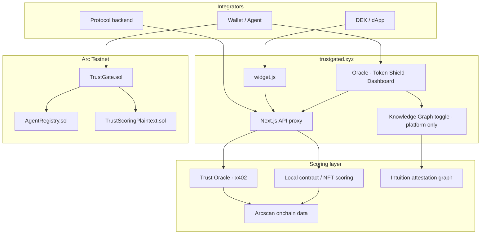
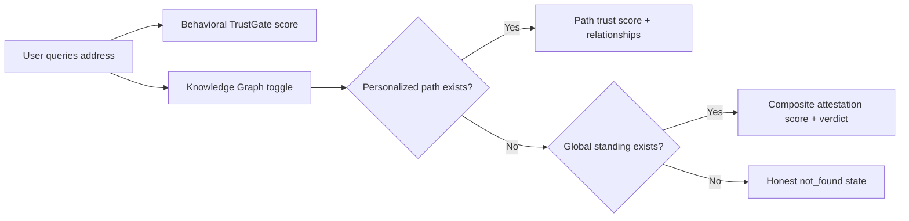
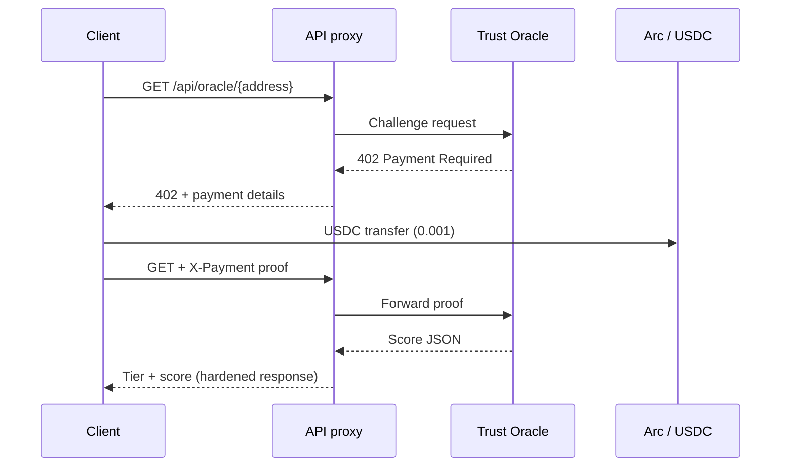
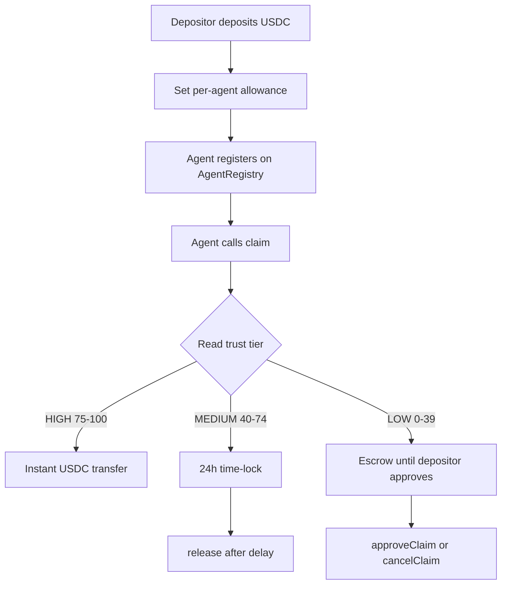

# TrustGate

Behavioral trust infrastructure for onchain systems. TrustGate scores wallets, tokens, and contracts from observed onchain behavior and exposes those signals for routing, gating, and integration.

Live: [trustgated.xyz](https://www.trustgated.xyz) · Docs: [docs.trustgated.xyz](https://docs.trustgated.xyz) · Chain: Arc Testnet (`5042002`)

---

## What it is

TrustGate answers one question for any address: **based on what this entity has actually done onchain, how much should it be trusted right now?**

It is infrastructure, not a gatekeeper. TrustGate returns a signal; your application decides what to do with it.

| TrustGate provides | Your application decides |
| --- | --- |
| Behavioral trust score and tier | Whether to proceed, warn, or block |
| Token and contract credibility signals | How to weight scores in your UI |
| Tier-routed USDC settlement onchain | Allowances, caps, and business rules |

TrustGate analyzes behavior, not identity. No KYC, no social graph, no self-reported credentials.

---

## Architecture



**Behavioral trust** (default everywhere): derived from direct onchain activity via the oracle and local scoring engines.

**Knowledge graph trust** (platform only): attestation and endorsement signals from the [Intuition](https://intuition.systems) knowledge graph, surfaced on trustgated.xyz as a second lens on the same address. Not exposed to integrators, the widget, or the public API.

---

## Dual trust sources (platform)

On the Oracle and Token Shield score views, users can switch between two independent signals for the same address:

| Source | What it measures | Default |
| --- | --- | --- |
| **Behavioral (TrustGate)** | What the address has done onchain | Yes |
| **Knowledge Graph (Intuition)** | What others have attested about the entity | No |

These are different kinds of trust. A wallet can show strong behavioral standing and weak graph standing, or the reverse. The gap is intentional context, not a single blended score.



Knowledge graph results are served through a server-side proxy on trustgated.xyz. Integrators never call the graph layer directly.

---

## Core primitives

| Primitive | Purpose | Access |
| --- | --- | --- |
| **Trust Oracle** | Paid wallet trust queries (x402, 0.001 USDC) | `/oracle`, `/api/oracle/[address]` |
| **Token Shield** | Token and contract credibility scoring | `/token-shield`, `/api/oracle/token/[address]` |
| **Widget** | Drop-in trust badges for DEX token inputs | `widget.js` + `data-trustgate` attributes |
| **TrustGate contract** | Tier-routed USDC claims for registered agents | Onchain `claim()` |
| **AgentRegistry** | Permissionless agent registration | Onchain `registerAgent()` |
| **Knowledge Graph view** | Intuition attestation context alongside behavioral scores | Platform only: `/oracle`, `/token-shield` |

Full integration detail: [docs.trustgated.xyz](https://docs.trustgated.xyz)

---

## Oracle query flow

Wallet scores are served through an x402-compatible oracle. The frontend proxies requests so browser clients never hold upstream credentials.



Public oracle responses return tier and score. Detailed breakdowns stay off the public API by design.

---

## Trust-gated payment flow

Onchain settlement routes USDC by trust tier at claim time. Tier is read from `TrustScoring`; routing is enforced in `TrustGate.claim()`.



Oracle tier bands (BLOCKED, LOW, MEDIUM, HIGH, HIGH_ELITE) apply to scoring API responses. Onchain payment routing uses the three-band contract mapping above.

---

## Scoring surfaces

| Address type | Surface | Payment |
| --- | --- | --- |
| Wallet (EOA) | Trust Oracle | 0.001 USDC via x402 |
| ERC-20 token | Token Shield (oracle) | 0.001 USDC via x402 |
| Contract (non-token) | Token Shield (local) | Free |
| NFT (ERC-721 / ERC-1155) | Token Shield (local) | Free |

Signals are behavioral: transaction history, deployments, interaction patterns, holder quality, deployer credibility, and bot-detection heuristics. Exact weights are not published.

---

## Widget integration

One script tag. No build step, no API key.

```html
<script src="https://www.trustgated.xyz/widget.js"></script>
<span data-trustgate="token-shield" data-trustgate-address="0xTokenAddress">USDC</span>
```

Backing endpoint:

```
GET https://www.trustgated.xyz/api/widget/score/[address]
```

Open CORS. Rate limit: 60 requests per minute per client.

Guide: [Widget integration docs](https://docs.trustgated.xyz/docs/widget-integration)

---

## Contracts (Arc Testnet)

Explorer: [testnet.arcscan.app](https://testnet.arcscan.app)

| Contract | Address |
| --- | --- |
| TrustScoringPlaintext | `0xEb979Dc25396ba4be6cEA41EAfEa894C55772246` |
| AgentRegistry | `0x73d3cf7f2734C334927f991fe87D06d595d398b4` |
| TrustGate | `0x52E17bC482d00776d73811680CbA9914e83E33CC` |

Sources and ABIs: `contracts/` · Reference: [Contract docs](https://docs.trustgated.xyz/docs/contracts)

---

## Repository layout

```
TrustGate/
├── frontend/          Next.js app, widget, API routes, docs site
├── contracts/         Solidity: TrustGate, AgentRegistry, TrustScoringPlaintext
├── scripts/           Agent loop and deployment utilities
└── test/              Foundry / Hardhat contract tests
```

### Frontend (`frontend/`)

| Path | Role |
| --- | --- |
| `src/app/oracle/` | Wallet trust playground + trust source toggle |
| `src/app/token-shield/` | Token and contract scoring UI + trust source toggle |
| `src/app/api/oracle/` | Oracle proxy (x402 forwarding) |
| `src/app/api/graph-trust/` | Knowledge graph proxy (platform only, Intuition) |
| `src/app/api/widget/score/` | Open CORS widget endpoint |
| `src/components/trust-source/` | Behavioral vs Knowledge Graph toggle UI |
| `public/widget.js` | Embeddable DEX badge script |

### Contracts (`contracts/`)

- **TrustGate.sol** — USDC payment gateway with tier-routed claims
- **AgentRegistry.sol** — Permissionless agent registration
- **TrustScoringPlaintext.sol** — Onchain trust score storage

---

## Local development

```bash
cd frontend
npm install
cp .env.example .env.local   # fill ORACLE_URL, no secrets in git
npm run dev
```

Contract tests and deployment scripts live at the repo root. Full setup: [Local setup guide](https://docs.trustgated.xyz/docs/local-setup)

---

## Documentation

Primary docs site: [docs.trustgated.xyz](https://docs.trustgated.xyz)

| Resource | URL |
| --- | --- |
| Docs index | [docs.trustgated.xyz](https://docs.trustgated.xyz) |
| How it works | [docs.trustgated.xyz/docs/how-it-works](https://docs.trustgated.xyz/docs/how-it-works) |
| Trust scoring (public) | [docs.trustgated.xyz/docs/trust-scoring](https://docs.trustgated.xyz/docs/trust-scoring) |
| Knowledge Graph (Intuition) | [docs.trustgated.xyz/docs/knowledge-graph](https://docs.trustgated.xyz/docs/knowledge-graph) |
| API reference | [docs.trustgated.xyz/docs/api-reference](https://docs.trustgated.xyz/docs/api-reference) |
| Widget integration | [docs.trustgated.xyz/docs/widget-integration](https://docs.trustgated.xyz/docs/widget-integration) |
| Agent loop | [docs.trustgated.xyz/docs/agent-loop](https://docs.trustgated.xyz/docs/agent-loop) |

Product direction and phase planning live on the site roadmap, not in this repository README.

---

## License

MIT — see [LICENSE](LICENSE).